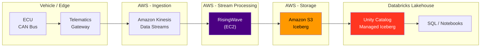

# CAN Streaming Demo: RisingWave + Databricks

Real-time vehicle CAN bus data processing with RisingWave streaming database and Databricks Lakehouse.

## Architecture

```
[Vehicle ECU]  ->  [Kinesis Data Streams]  ->  [RisingWave on EC2]  ->  [Iceberg Sink (S3)]
                                                   |  MV: CAN binary decode
                                                   |  MV: 1-min aggregation
                                                   v
                                          [Databricks Batch Job]  ->  [UC Managed Iceberg]
                                                                           |
                                                                      [SQL / Notebooks / AI-ML]
```



## CAN Frame Format (20 bytes binary)

| Offset | Size | Field | Description |
|--------|------|-------|-------------|
| 0-7 | 8B | Timestamp | Unix epoch ms (Big Endian) |
| 8-9 | 2B | CAN ID | Arbitration ID |
| 10 | 1B | DLC | Data Length (always 8) |
| 11-18 | 8B | DATA | Sensor payload |
| 19 | 1B | CRC | XOR checksum |

### Sensor Types

| CAN ID | Sensor | Decode |
|--------|--------|--------|
| 0x0B0 | Speed (km/h) | `DATA[0:2] / 100.0` |
| 0x0C0 | RPM | `DATA[0:2] / 4.0` |
| 0x1A0 | Fuel (%) | `DATA[0] / 2.55` |
| 0x300 | GPS (lat/lon) | `4B each, /1e5 - offset` |
| 0x400 | Accelerometer | 3-axis (m/s^2) |
| 0x500 | Battery | Voltage + SOC |

## Prerequisites

- AWS account with CLI configured
- Databricks workspace (AWS)
- [Terraform](https://developer.hashicorp.com/terraform/install) >= 1.5
- [Databricks CLI](https://docs.databricks.com/dev-tools/cli/install.html) with DAB support
- `psql` (optional, for direct RisingWave access)

## Quick Start

### 1. Clone and configure

```bash
git clone https://github.com/YOUR_ORG/can-streaming-demo.git
cd can-streaming-demo

# Copy the config template and fill in your values
cp terraform/terraform.tfvars.example terraform/terraform.tfvars
```

Edit `terraform/terraform.tfvars` with your:
- AWS VPC/subnet IDs
- Your IP address (for security group access)
- Databricks workspace URL and token
- Databricks storage credential name and IAM role ARN

### 2. Deploy infrastructure

```bash
make deploy-infra
```

This provisions:
- **S3 bucket** for Iceberg data and UC managed storage
- **Kinesis Data Stream** for CAN frame ingestion
- **EC2 instance** with RisingWave (auto-configured pipeline)
- **Security Group** with access for your IP
- **S3 VPC Endpoint** for SCP-compliant access
- **Unity Catalog** catalog, schema, and external location

### 3. Deploy notebooks

```bash
make deploy-notebooks
```

Deploys Databricks notebooks and job definitions via DAB.

### 4. Run the demo

Run notebooks in order:

| Step | Notebook | Description |
|------|----------|-------------|
| 1 | `01_kinesis_producer` | Generate CAN data and send to Kinesis |
| 2 | `02_risingwave_pipeline` | Verify RisingWave pipeline is processing |
| 3 | `rw_to_uc_ingestion` | Batch load from RisingWave to UC Managed Iceberg |
| 4 | `03_databricks_catalog` | Analyze data in Unity Catalog |
| 5 | `04_monitoring` | View pipeline metrics and data quality |

### 5. Access RisingWave directly

After `terraform apply`, the outputs show connection info:

```bash
# Dashboard (browser)
terraform -chdir=terraform output risingwave_dashboard_url

# psql
eval $(terraform -chdir=terraform output -raw risingwave_psql_command)
```

## Cleanup

```bash
make destroy
```

## Project Structure

```
.
├── Makefile                    # Deploy/destroy commands
├── terraform/                  # AWS + Databricks infrastructure
│   ├── terraform.tfvars.example  # <- THE config file
│   ├── aws_ec2.tf             # EC2 + RisingWave
│   ├── aws_kinesis.tf         # Kinesis stream
│   ├── aws_s3.tf              # S3 bucket
│   ├── aws_iam.tf             # IAM roles
│   ├── aws_networking.tf      # Security group + VPC endpoint
│   ├── databricks_uc.tf       # Unity Catalog resources
│   └── templates/             # EC2 userdata + RW SQL templates
├── databricks.yml             # DAB bundle config
├── resources/jobs.yml         # Databricks job definitions
├── src/                       # Databricks notebooks
│   ├── 00_setup.py            # Shared config (widgets)
│   ├── 01_kinesis_producer.py # CAN data -> Kinesis
│   ├── 02_risingwave_pipeline.py  # RW pipeline verification
│   ├── 03_databricks_catalog.py   # UC analysis
│   ├── 04_monitoring.py       # Pipeline monitoring
│   └── rw_to_uc_ingestion.py  # Batch: RW -> UC Iceberg
└── docs/
    └── architecture.md        # Detailed architecture comparison
```
